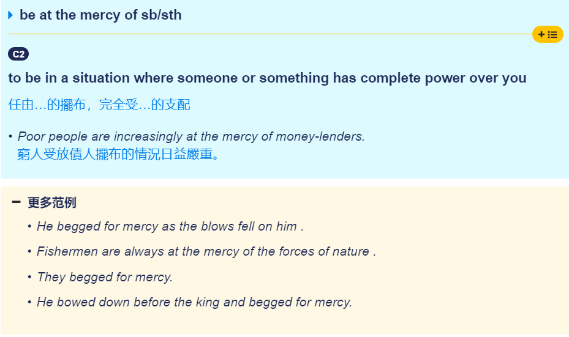

# 1.单词记忆

## 2020/1/18

### **capture**

1. **激起，激发**

[1998 英一 Text1]

> Few creations of big technology **capture** the imagination like gaint gams.
>
> 含有高技术的造物中很少有像大坝这样能够激起人类想象力的。

### mercy

1. **摆布**

[1998 英一 Text1]

> Perhaps it is humankind's long suffering **at the mercy of flood and drought **that makes the idea **of forcing the water to do our bidding** so facinating.
>
> 也许正是人类长期受到旱涝灾害的摆布才使得“让水资源为我所用”的这种想法如此吸引人。

 **mercy** : 虽然在大部分情况下，mercy的含义为`仁慈，恩惠`，但是在这里我们显然不能使用这个含义，而是另外的含义`受...摆布`

## 2020/1/19

### bidding

1. **命令，吩咐**

[1998 英一 Text1]

> forcing the water to do our bidding
>
> 让水资源听命于我们

to do one's bidding，听命于某人

### threaten

0. **真题1：可能发生**

[1998 英一 Text1]

> Serveral gaint dam projects threaten to do more harm than good.

1. **威胁，恐吓，扬言要**

**to** [tell](https://dictionary.cambridge.org/zht/詞典/英語-漢語-繁體/tell) **someone that you will** [kill](https://dictionary.cambridge.org/zht/詞典/英語-漢語-繁體/kill) **or** [hurt](https://dictionary.cambridge.org/zht/詞典/英語-漢語-繁體/hurt) **them or** [cause](https://dictionary.cambridge.org/zht/詞典/英語-漢語-繁體/cause) [problems](https://dictionary.cambridge.org/zht/詞典/英語-漢語-繁體/problem) **if they do not do what you** [want](https://dictionary.cambridge.org/zht/詞典/英語-漢語-繁體/want)

例：

> They threatened the shopkeeper with a gun.

> They threatened to kill him unless he did as they asked.

2. **威胁到，危害到**

**to be** [likely](https://dictionary.cambridge.org/zht/詞典/英語-漢語-繁體/likely) **to** [cause](https://dictionary.cambridge.org/zht/詞典/英語-漢語-繁體/cause) [harm](https://dictionary.cambridge.org/zht/詞典/英語-漢語-繁體/harm) **or** [damage](https://dictionary.cambridge.org/zht/詞典/英語-漢語-繁體/damage) **to something or someone**

例:

> Changing patterns of agriculture are threatening the countryside.

3. **预示凶兆，逼近**

**If something** [bad](https://dictionary.cambridge.org/zht/詞典/英語-漢語-繁體/bad) **threatens to** [happen](https://dictionary.cambridge.org/zht/詞典/英語-漢語-繁體/happen)**, it is** [likely](https://dictionary.cambridge.org/zht/詞典/英語-漢語-繁體/likely) **to** [happen](https://dictionary.cambridge.org/zht/詞典/英語-漢語-繁體/happen)**.**

例:

> Look at those clouds! There is a storm threatening.

### cement

1. v 加强，巩固

### bid

1. 为...做出努力

